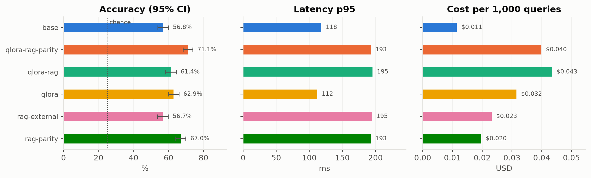
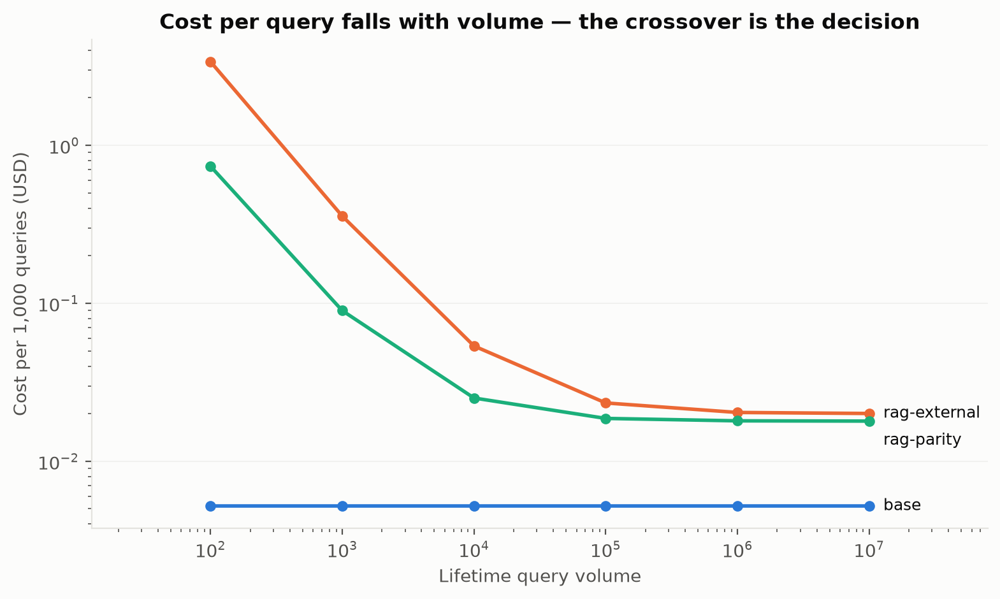
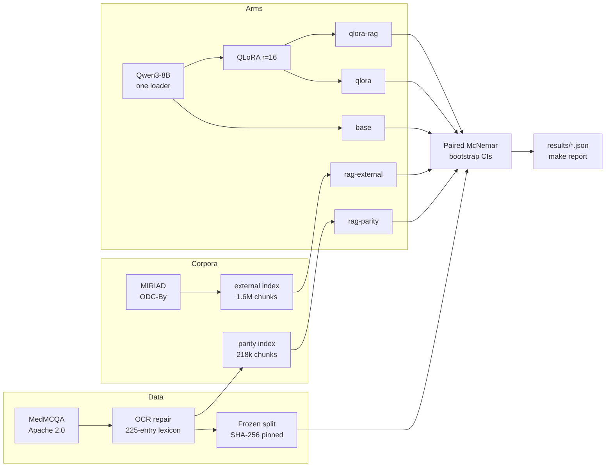

# Fine-Tune vs. Retrieve

**Retrieval beat fine-tuning by 4 points on identical information — and the same
retrieval over a different corpus was worth exactly nothing.**

A controlled six-arm benchmark in clinical multiple-choice QA. One base model,
one frozen 1,000-item test set, one prompt, one GPU. Every number below comes
from a committed JSON file and regenerates with `make report`.

**[Live demo](https://huggingface.co/spaces/vireshk/fine-tune-vs-rag)** ·
**[Adapter + model card](https://huggingface.co/vireshk/qwen3-8b-medmcqa-qlora)** ·
**[Full report](REPORT.md)** · **[Handover](docs/HANDOVER.md)**

<picture>
  <source media="(prefers-color-scheme: dark)" srcset="results/figures/arms-dark.png">
  
</picture>

## Results

| Arm | Accuracy | 95% CI | p50 | p95 | Prompt tokens |
| --- | ---: | :---: | ---: | ---: | ---: |
| `qlora` — fine-tuned | **62.9%** | [60.0, 65.9] | 102 ms | 112 ms | 113 |
| `qlora-rag` — fine-tuned + retrieval | 61.4% | [58.4, 64.4] | 179 ms | 195 ms | 738 |
| `base` — zero-shot | 56.8% | [53.8, 59.9] | 103 ms | 118 ms | 113 |
| `rag-external` — retrieval only | 56.7% | [53.6, 59.8] | 179 ms | 195 ms | 738 |

Two **diagnostic** arms retrieve the exact text the fine-tune trained on, which
is what makes the central comparison possible:

| Diagnostic arm | Accuracy | vs `base` |
| --- | ---: | ---: |
| `rag-parity` | **67.0%** | +10.2 (p<0.0001) |
| `qlora-rag-parity` | **71.1%** | +14.3 (p<0.0001) |

Minimum detectable effect at n=1,000 is **6.3 points**. Comparisons use paired
McNemar over identical items. Every table reports training seed 42; the trained
arms were replicated at two further seeds — `qlora` 62.8 ± 1.1,
`qlora-rag` 62.3 ± 0.8, `qlora-rag-parity` 71.7 ± 0.8.

## The four findings

**1. On identical information, the index beat the weights.** `rag-parity`
retrieves the same MedMCQA explanations the fine-tune trained on — same base
model, same prompt, same facts. Retrieval gained +10.2 points, fine-tuning
+6.1 — and across three training seeds the gap is **+4.2 points, 95% CI [+1.0, +7.2], p = 0.008**.

**2. Retrieval over the wrong corpus was worth nothing.** `rag-external` reads
1.6M chunks of peer-reviewed literature and scores **+0.001 against base
(p = 1.000, discordant 121/120)** — a true null, not an underpowered one. Yet
its retrieval *works*: it surfaces the gold answer in 45.4% of items. Lexical
presence of an answer is not usable evidence. **The corpus mattered more than
the technique.**

**3. Fine-tuning's MCQ gain reverses when the model must *produce* the
answer.** Asked open-ended and graded by a 70B judge, `qlora` scores **5.8
points below its own base** (p = 0.022) where it gained +6.1 on multiple
choice; retrieval's +10.2 transfers almost intact (+9.3). The adapter learned to
pick among candidates, not the facts to generate one — the index carries
knowledge, the weights carried a format. Position bias controlled by judging
both orders; human κ pending.

**4. Fine-tuning repays its training cost at ~200,000 queries.** A *merged*
adapter has identical inference cost to the base (102 ms vs 103 ms), so
fine-tuning's advantage is purely prompt length: 113 tokens versus 738.

<picture>
  <source media="(prefers-color-scheme: dark)" srcset="results/figures/cost-crossover-dark.png">
  
</picture>

## Pipeline



## Quickstart

```bash
git clone https://github.com/vireshkoli/Fine-Tune-vs-RAG && cd Fine-Tune-vs-RAG
uv sync --group dev
make check           # ruff + mypy(strict) + 359 tests — CPU only, no GPU needed
make verify-splits   # proves the frozen test set still hashes identically
```

With a GPU:

```bash
make setup-gpu
make index CORPUS=parity                          # ~11 min
make train CONFIG=configs/train/qlora_r16.yaml    # ~5.1 GPU-hours
make eval ARM=base
make report                                       # regenerates tables + figures
```

## How fairness is enforced

Asserted in tests, not promised in prose:

- **One `from_pretrained`** in the codebase; arms share the same model object.
- **One prompt builder** — stripping a RAG prompt's context must reproduce the
  non-RAG prompt byte for byte, and the *training* prompt is built by the same
  function.
- **Constrained A/B/C/D log-prob scoring**, never free generation — otherwise
  fine-tuned arms gain from learned formatting rather than knowledge.
- **Shared 3,000-character context budget** across RAG arms, so corpus quality
  is not confounded with context length.
- **Indices built from train-side text only**, gated on content hash — a test
  item's explanation cannot enter an index under a different id.
- **Pinned model revisions**; **fixed batch size** (it perturbs bf16 numerics).

## Ablations

The full grid (rank, epochs, top-k, embedder, quantisation, seeds, cross-base)
runs from `make matrix`; results land in `results/ablations/` and are written up
in [REPORT.md](REPORT.md#75-ablations). Worth surfacing here:

**The headline survives three training seeds.** Retrained at seeds 1 and 2, the
index beats the weights at every seed (+4.1, +3.1, +5.3). A seed-aware paired
permutation test over all three puts the gap at **+4.2 points, 95% CI [+1.0, +7.2], p = 0.008** — 3.8× the
training-seed SD.

**Lower validation loss did not buy accuracy.** Validation loss falls
monotonically with LoRA rank (r=8 → r=64), but test accuracy is flat — every
rank within 0.3 points of r=16, inside the 1.1-point seed SD. Extra epochs cost
up to 3× and trended *worse* (62.9 → 62.4 → 61.6). The loss is dominated by
explanation tokens; accuracy is scored on one letter.

**The finding replicates on Llama-3.1-8B.** Same recipe, no retuning: the
index beats the weights by +4.4 points on Llama (p=0.019) versus +4.1 on Qwen
(p=0.016), and every other paired comparison keeps its sign and significance.
The conclusion is about fine-tuning versus retrieval, not about Qwen3.

**Retrieval depth is not the lever.** On the parity corpus, k saturates at 5
under the shared context budget (k=10: +0.5, p=0.58). On the external corpus
k does nothing at any value. A domain-specific embedder (MedEmbed) did not
help either: lower hit rate on both corpora, accuracy within noise.

**4-bit serving is free on short prompts and expensive on long ones.** NF4 costs
`base` 0.7 points (p=0.56) and is *faster* — 95 ms vs 103 ms. The same
quantisation costs the RAG arm **2.5 points (p=0.006) and is 33% slower** (227 ms
vs 171 ms). Both the speed win and the quality cost invert with prompt length, so
a quantisation decision benchmarked without retrieval does not transfer to a RAG
deployment.

## Honest limitations

- ~~Single seed.~~ **Measured**: three training seeds. Fine-tuned accuracy
  spreads 1.1 points across seeds, and the headline holds at +4.2 points, 95% CI [+1.0, +7.2], p = 0.008.
  The rank and epoch ablations are single-seed and read against that spread.
- **Contamination is present but measured, not hand-waved.** ~9% of test stems
  are reproduced verbatim above a shuffled-reference chance baseline, so some
  absolute accuracy is recall. But shuffling the answer options changes the base
  model's score by **−1.6 points** — it is not relying on memorised labels — and
  contamination is roughly constant across arms, so the between-arm comparisons
  are largely unaffected. The fine-tune did pick up mild positional sensitivity
  (+3.2) the base model lacks. Full detail in [REPORT.md](REPORT.md#55-contamination-measured-not-assumed).
- **31.3% of MedMCQA's labelled pool is dentistry**, the subject where retrieval
  helps least. Excluding it, `rag-parity` reaches 74.2% and `base` 59.8% — the
  headline *understates* the effect on genuinely medical subjects.
- ~~The two indices differ 7.3× in size.~~ **Measured and resolved**: rebuilding
  the external index at exactly the parity chunk count *widened* the gap from
  +10.3 to +16.4 points, so the effect is corpus content, not size. That run
  also showed a thin wrong corpus scoring **6.2 points below no retrieval at
  all** (p<0.0001) — bad RAG is a regression, not a wash.
- **Free-text results rest on one LLM judge.** Self-consistent (SD ≤ 0.011)
  and cross-family from every arm, but the 50-item human κ is not yet done.

Full methodology, per-subject breakdowns, error taxonomy and the decision
framework: **[REPORT.md](REPORT.md)**.

## Artifacts

| | |
| --- | --- |
| **Demo** | [huggingface.co/spaces/vireshk/fine-tune-vs-rag](https://huggingface.co/spaces/vireshk/fine-tune-vs-rag) — static, precomputed from the committed runs, so it needs no GPU quota and never sleeps |
| **Adapter** | [huggingface.co/vireshk/qwen3-8b-medmcqa-qlora](https://huggingface.co/vireshk/qwen3-8b-medmcqa-qlora) — LoRA r=16, with the full model card |
| **Results** | `results/runs/*.json` — one file per arm, including every per-item prediction |
| **Resurrection** | [docs/HANDOVER.md](docs/HANDOVER.md) — how to rebuild all of this on another machine after the lab disk is wiped |

## Stack

Python 3.12 · uv · Qwen3-8B (Apache 2.0) · QLoRA via `peft`/`bitsandbytes`/`trl`
· FAISS · `bge-large-en-v1.5` · ruff + mypy(strict) + pytest · GitHub Actions

Built on shared university GPUs, so every artifact is reconstructible from
GitHub and the Hugging Face Hub alone: caches are pinned inside the project,
model revisions are pinned to commit SHAs, and teardown can only ever delete one
directory.

> **Not for clinical use. Not medical advice. Not validated on real patients.**

## Licence

MIT for the code. MedMCQA is Apache 2.0; MIRIAD is ODC-By 1.0. MedQA was
deliberately not used — `bigbio/med_qa` declares its licence "unknown", and a
re-uploader's `cc-by-4.0` tag does not launder upstream copyright on USMLE
board-prep material.
